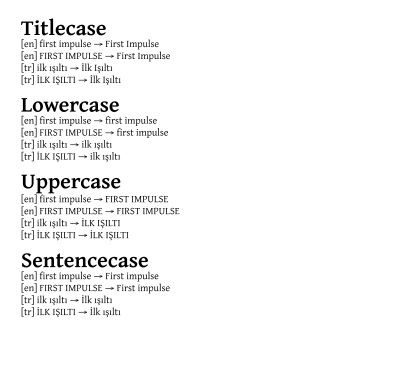

# Decasify Package for The SILE Typesetter

A thin wrapper around the [decasify](https://github.com/alerque/decasify) library providing SILE functions for locale and style guide aware text casing functions.
Provides functions for title-case (and other cases) that adapt to the language of the current document context.
Includes support for Turkish and multiple style guides.

## Example One

* The heading in this example will automatically be converted to title case.
* The body text is untouched, but a manual command is used to sentence case a whole phrase.
* Changing the text language, we show using the functions again will follow the new language rules.

```sile
\begin[papersize=12cm x 4cm]{document}
\nofolios
\neverindent
\language[main=en]
\use[module=packages.decasify]

% Pretend this demo is using the book class by defining a comparable chapter function
\define[command=chapter]{\hbox{}\bigskip\book:chapterfont{\process}\bigskip}

% Override the default chapter styling to include a title-case transformation
\define[command=book:chapterfont]{\font[size=22pt,weight=800]{\decasify[case=title]{\process}}}

\chapter{all headings will be titlecase}

\decasify[case=sentence]{a manually sentence-cased phrase.}

Now switch languages and show Turkish titlecasing:

\language[main=tr]

\decasify[case=title]{ilk ışıltı}

\end{document}
```


## Example Two

* Using the same input samples, iterate all four possible output cases.
* Use language specific rules for each sample highlighting how character handling is different.

```typst
\begin[papersize=8cm x 13cm]{document}
\nofolios
\neverindent
\use[module=packages.decasify]
\begin{lua}

local examples = {
   { "first impulse", lang = "en" },
   { "FIRST IMPULSE", lang = "en" },
   { "ilk ışıltı", lang = "tr" },
   { "İLK IŞILTI", lang = "tr" },
}

for _, case in ipairs({ "title", "lower", "upper", "sentence" }) do
   SILE.call("bigskip")
   SILE.call("font", { size = "22pt", weight = 800 }, function ()
      SILE.call("decasify", { case = "title" }, { case .. "case" })
   end)
   SILE.call("par")
   for _, s in ipairs(examples) do
      SILE.typesetter:typeset(("[%s] "):format(s.lang))
      SILE.call("font", { language = s.lang }, function (_, _)
         SILE.typesetter:typeset(("%s → "):format(s[1]))
         SILE.call("decasify", { case = case }, s)
      end)
      SILE.call("par")
   end
end

\end{lua}
\end{document}
```


