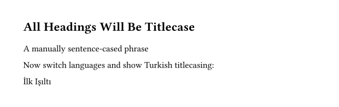

# Decasify package for Typst

A thin wrapper around the [decasify](https://github.com/alerque/decasify) library providing Typst functions for locale and style guide aware text casing functions.
Provides functionns for title-case (and other cases) that adapt to the language of the current document context.
Includes support for Turkish and multiple style guides.

```typst
#import "decasify.typ": *

#set page(width: auto, height: auto, margin: 1cm)

#set text(lang: "en")

#show heading: it => [
  #titlecase(it.body)
]

= all headings will be titlecase

#sentencecase("a manually sentence-cased phrase")

Now switch languages and show Turkish titlecasing:

#set text(lang: "tr")

#titlecase("ilk ışıltı")
```


